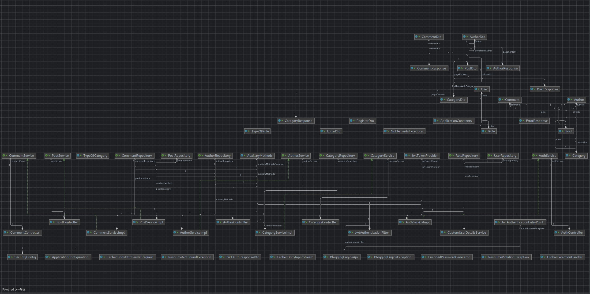

# Blogging Engine API 🎉️

👷 Under Development 🚀️

## Overview

The **Blogging Engine API** is a robust and scalable backend service designed to manage a blogging platform. It provides endpoints for user authentication, post management, and comment handling, ensuring a seamless experience for both content creators and readers.

## Architecture

The API follows a layered architecture, ensuring separation of concerns and promoting maintainability:

1. **Controller Layer**: Handles HTTP requests and responses.
2. **Service Layer**: Contains business logic.
3. **Repository Layer**: Manages data persistence using Spring Data JPA.
4. **Security Layer**: Manages authentication and authorization using Spring Security and JWT.

 

> UML Diagram

## Contributing

Contributions are welcome! Please fork the repository and create a pull request.

## License

This project is licensed under the MIT License.

## Contact

For any inquiries, please contact me www.linkedin.com/in/valentin-soare
